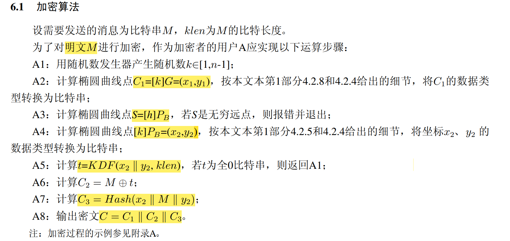
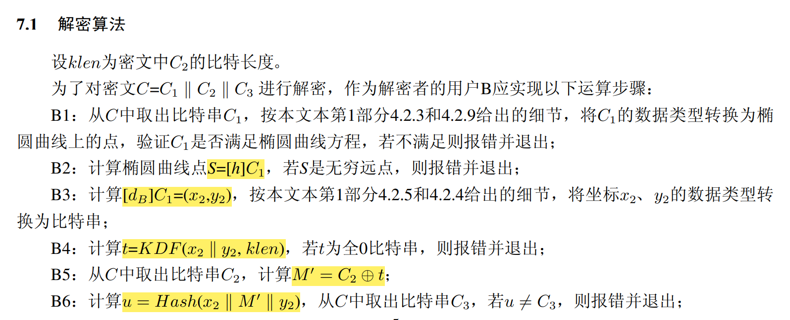
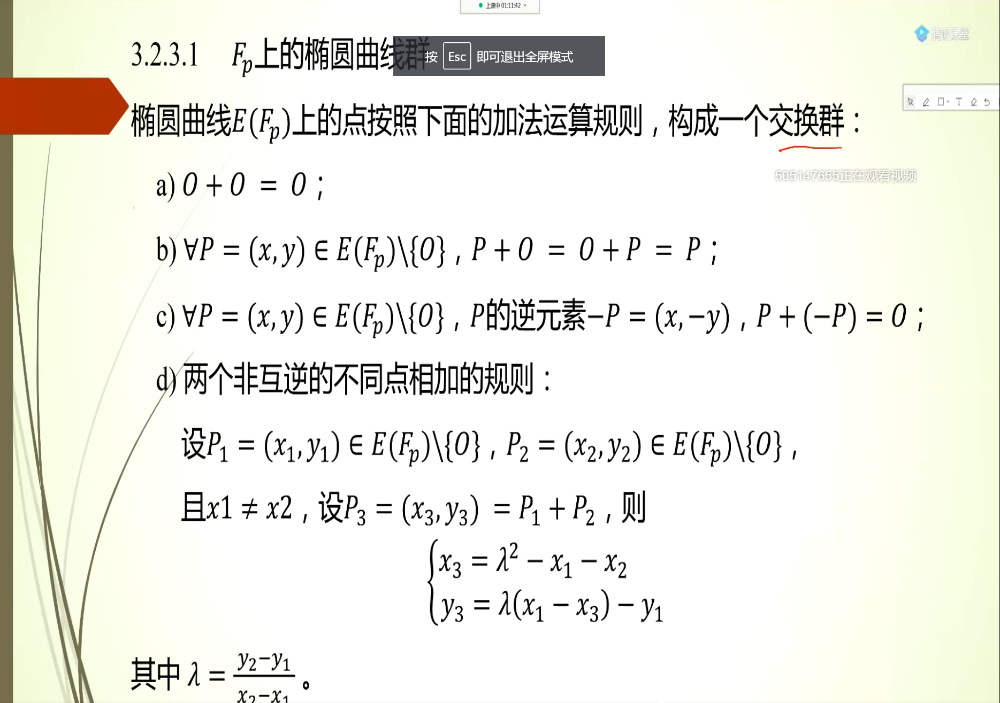
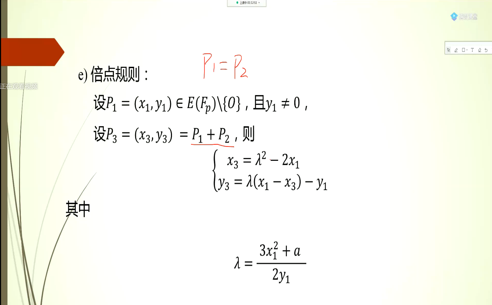

**公钥Pb，私钥db，密文C1 || C2 || C3，明文M**

### 加密流程

### 解密流程

**C1：基点的随机倍点运算结果，可以用于验证椭圆曲线和解密**

**C2：明文有关的杂凑值，其中t是由密钥派生函数生成，x2y2是公钥的倍点运算结果**

**C3：明文有关的杂凑值，x2 M y2的拼接，用于正确性验证**

用户密钥对需要满足：

基点的选取：

椭圆曲线推荐参数：

